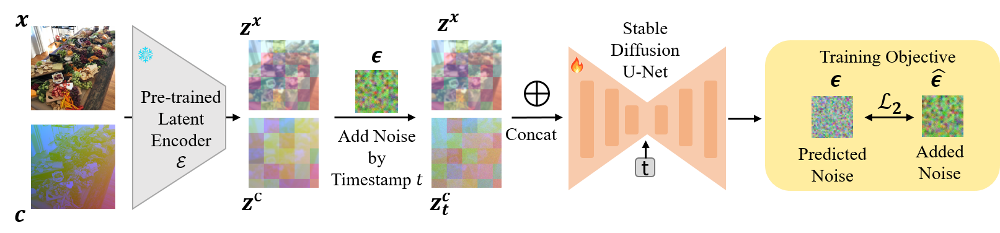

<div align="center">
    <h1>DM-Calib</h1>
    <h2> Boost 3D Reconstruction using Diffusion-based Monocular Camera Calibration</h2> <br>
     <strong>We will open source the complete code after the paper is accepted ！</strong> <br><br>
     <a href='https://arxiv.org/abs/2411.17240'></a>
     <a href='https://huggingface.co/juneyoung9/DM-Calib'></a>
</div>

**DM-Calib** is a diffusion-based approach for estimating pinhole camera intrinsic parameters from a single input image. We introduce a new image-based representation, termed Camera Image, which losslessly encodes the numerical camera intrinsics and integrates seamlessly with the diffusion framework. Using this representation, we reformulate the problem of estimating camera intrinsics as the generation of a dense Camera Image conditioned on an input image. By fine-tuning a stable diffusion model to generate a Camera Image from a single RGB input, we can extract camera intrinsics via a RANSAC operation. We further demonstrate that our monocular calibration method enhances performance across various 3D tasks, including zero-shot metric depth estimation, 3D metrology, pose estimation and sparse-view reconstruction.

<p align="center">
  
</p>


## 📢 News


- [2024/11.27]: 🔥 We release the DM-Calib paper on arXiv !

</br>

## 🛠️ Installation

- Linux
- Python 3.10
- [Torch](https://pytorch.org/) 2.3.1+cuda11.8
- [Diffusers](https://github.com/huggingface/diffusers)

For more required dependencies, please refer to `requirements.txt`.

Here is a minimal usage example:

```python
from geocalib import GeoCalib

device = "cuda" if torch.cuda.is_available() else "cpu"
model = GeoCalib().to(device)

# load image as tensor in range [0, 1] with shape [C, H, W]
image = model.load_image("path/to/image.jpg").to(device)
result = model.calibrate(image)

print("camera:", result["camera"])
print("gravity:", result["gravity"])
```

## Inference

Coming soon~


## Data

Most of our training and testing datasets are from [MonoCalib](https://github.com/ShngJZ/WildCamera/blob/main/asset/download_wildcamera_dataset.sh).

More training datasets are from [Taskonomy](https://github.com/StanfordVL/taskonomy/tree/master/data), [hypersim](https://github.com/StanfordVL/taskonomy/tree/master/data), [TartanAir](https://theairlab.org/tartanair-dataset/), [Virtual KITTI 2](https://europe.naverlabs.com/research/computer-vision/proxy-virtual-worlds-vkitti-2/), [Argoverse2](https://www.argoverse.org/av2.html), [Waymo](https://waymo.com/open/).


## 🎓 Citation

If you find our work helpful, please cite our paper:

```bibtex
@misc{deng2024boost3dreconstructionusing,
      title={Boost 3D Reconstruction using Diffusion-based Monocular Camera Calibration}, 
      author={Junyuan Deng and Wei Yin and Xiaoyang Guo and Qian Zhang and Xiaotao Hu and Weiqiang Ren and Xiaoxiao Long and Ping Tan},
      year={2024},
      eprint={2411.17240},
      archivePrefix={arXiv},
      primaryClass={cs.CV},
      url={https://arxiv.org/abs/2411.17240}, 
}
```


